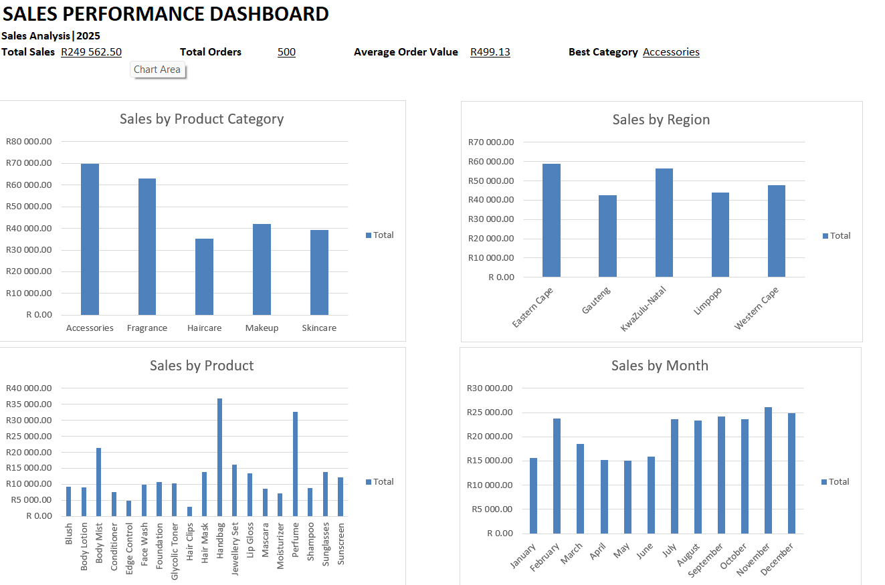

# Retail Sales Analysis Dashboard

## 📊 Project Overview

This project analyzes retail sales data using Microsoft Excel to identify sales trends, top-performing products, categories, and regions.

The project demonstrates the process of taking raw sales data, cleaning and standardizing it, analyzing the data using PivotTables, and presenting insights through an interactive dashboard.

## 📊 Dashboard

## 🎯 Project Objectives

- Clean and standardize retail sales data
- Calculate key sales metrics
- Identify the best-performing product category
- Identify the best-selling product
- Compare sales performance across regions
- Analyze monthly sales performance
- Create charts and a sales dashboard

## 🛠️ Tools Used

- Microsoft Excel
- Data Cleaning
- Excel Formulas
- PivotTables
- PivotCharts
- Data Visualization

## 📈 Key Metrics

| Metric | Result |
|---|---:|
| Total Sales | R249,562.50 |
| Total Orders | 500 |
| Average Order Value | R499.13 |
| Best Category | Accessories |
| Best Product | Handbag |
| Best Region | Eastern Cape |
| Best Sales Month | November |

## 💡 Key Insights

- **Accessories** was the highest-performing product category.
- **Handbags** generated the highest sales among individual products, with net sales of **R36,859.07**.
- **Eastern Cape** was the highest-performing region, with net sales of **R58,896.69**.
- **November** recorded the highest monthly sales, with net sales of **R26,127.17**.

## 🧹 Data Cleaning

The dataset was prepared for analysis by:

- Checking for duplicate records
- Standardizing data formats
- Checking calculations
- Formatting dates correctly
- Ensuring sales values were consistent
- Creating a Month field for monthly analysis

## 📊 Dashboard

The final Excel dashboard presents:

- Total Sales
- Total Orders
- Average Order Value
- Best Performing Category
- Sales by Product Category
- Sales by Region
- Sales by Product
- Monthly Sales

## 📁 Project Files

- `Retail_Sales_Analysis_Dashboard.xlsx` — Complete Excel analysis and dashboard

## 🚀 Conclusion

This project demonstrates my ability to use Excel to clean, analyze, visualize, and communicate insights from a retail sales dataset.

It is part of my journey toward becoming a data analyst.
